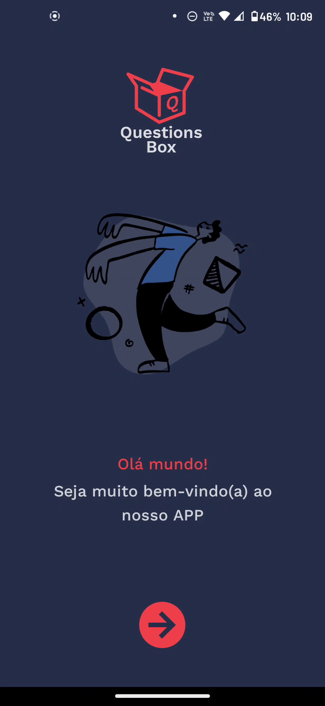
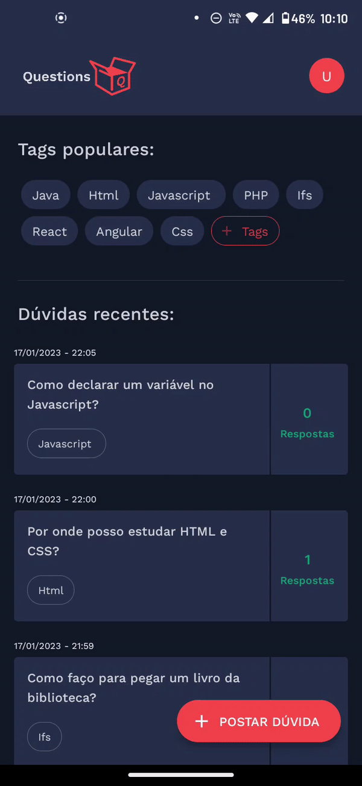
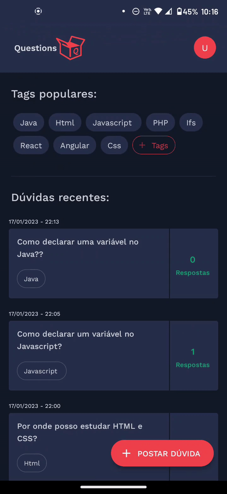

<h1 align="center"> Questions Box </h1> <br>

<p align="center">
  
</p>

<p align="center">
  Aplicação desenvolvida em React Native para a matéria de Programação para dispositivos móveis
</p>

&nbsp;
&nbsp;
&nbsp;
&nbsp;

## Problema

- Um fator perceptível no campus Lagarto é a falta de interatividade entre
os alunos sobre questões relacionadas aos cursos. Se alunos veteranos
interagem mais com os calouros seria possível criar uma rede de ajuda entre
eles;

- Os alunos não sabem onde tirar suas dúvidas tendo assim que recorrer a
professores ou até grupos de whatsapp;

## Solução

- O aplicativo, por sua usabilidade, é fácil de se cadastrar e fazer uma
pergunta. Uma vez que essa pergunta é feita poderá ser respondida por outros
alunos que tenham conhecimento sobre o assunto, seja ele veterano ou não.

- Com a ajuda do aplicativo, o aluno pode tirar suas dúvidas com muito mais rapidez, pois sempre terá alguém para auxiliá-lo à palma de sua mão.

## Protótipo FIGMA

- O protótipo da aplicação pode ser visto nesse link: [Questions Box - FIGMA](https://www.figma.com/file/uWypl4okI5vZFMWqmrYNFB/Projeto-Programa%C3%A7%C3%A3o-Mobile?node-id=0%3A1&t=G0Ti5sf4k8gASjY0-1)

<a href="https://www.figma.com/file/uWypl4okI5vZFMWqmrYNFB/Projeto-Programa%C3%A7%C3%A3o-Mobile?node-id=0%3A1&t=G0Ti5sf4k8gASjY0-1" target="_blank">
<p align="center">
    
</p>
</a>

## Pré-requisitos

 - Ter o [Expo Go](https://expo.dev/expo-go) instalado.
 - Ter o [NodeJS](https://nodejs.org/) instalado.

## Instalando

Para instalar, execute o seguinte comando na pasta do projeto:

```js
    npm install
```

## Executando o projeto

Para rodar o projeto execute o seguinte comando na pasta do projeto:

```js
    npx expo start
```

Basta lê o QrCode gerado atraves do aplicativo do Expo Go instalado em seu smartphone.

## Resultado

**O app foi executado apenas em android!**

<p align="center">
  
  
  
</p>

<p align="center">
</p>

<p align="center">
</p>

## Valeu pela visita! 😉
